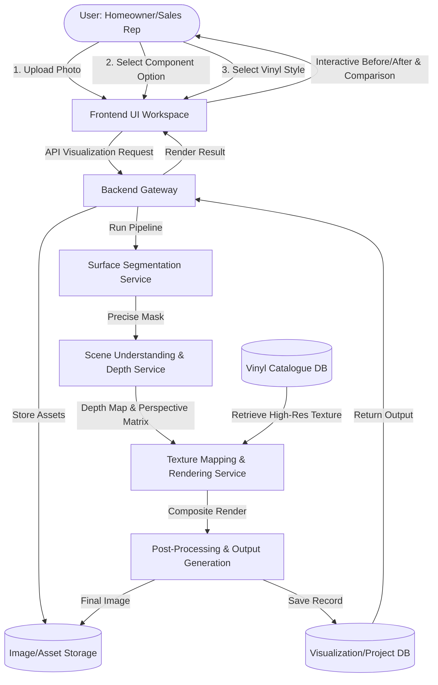

# System Design Specification: AI-Powered Vinyl Wrapping Visualization System

This document outlines the detailed system design, user interface layout, and backend AI processing pipeline for the **AI-Powered Vinyl Wrapping Visualization System**. It is compiled by analyzing the Product Requirements Document (PRD), App Flow, and Data Flow specifications.

---

## 1. System Architecture Overview

The system operates as a modular, client-server web application. The frontend provides an interactive, state-driven user experience, while the backend utilizes microservices to run deep-learning-based computer vision pipelines for segmentation, perspective estimation, texture mapping, and physically-based rendering.



---

## 2. User Interface & Screen Layout Design

The user interface is designed to lead the user through a clear, intuitive 4-step wizard/workspace. 

### Screen Layout Structure

```
+--------------------------------------------------------------------------------------------------+
|  AI VINYL WRAPPER                                                 [Project History] [Settings]   |
+--------------------------------------------------------------------------------------------------+
|                                                                                                  |
|   1. IMAGE UPLOAD AREA                      2. SURFACE / COMPONENT SELECTOR                      |
|  +---------------------------------------+  +-------------------------------------------------+  |
|  |                                       |  |  Choose surface(s) to wrap:                     |  |
|  |  [ Drag & Drop Room/Surface Photo ]   |  |                                                 |  |
|  |                   or                  |  |  ( ) Wall      ( ) Cabinet     ( ) Wardrobe     |  |
|  |            [ Browse File ]            |  |  ( ) Floor     ( ) Door        ( ) Ceiling      |  |
|  |                                       |  |  ( ) Counter   ( ) Furniture   ( ) Glass Panel  |  |
|  +---------------------------------------+  +-------------------------------------------------+  |
|                                                                                                  |
|   3. VINYL CATALOGUE                                                                             |
|  +---------------------------------------------------------------------------------------------+  |
|  |  Filters: [ Color  v ] [ Finish v ] [ Search... ]                                           |  |
|  |  +------------------+  +------------------+  +------------------+  +------------------+     |  |
|  |  | [Texture Preview]|  | [Texture Preview]|  | [Texture Preview]|  | [Texture Preview]|     |  |
|  |  | Glossy Oak       |  | Matte Charcoal   |  | Brushed Brass    |  | White Marble     |     |  |
|  |  | ID: V001         |  | ID: V002         |  | ID: V003         |  | ID: V004         |     |  |
|  |  +------------------+  +------------------+  +------------------+  +------------------+     |  |
|  +---------------------------------------------------------------------------------------------+  |
|                                                                                                  |
|   4. AI VISUALIZATION PREVIEW & COMPARISON                                                       |
|  +---------------------------------------------------------------------------------------------+  |
|  |  [  Before / Original Image  ]    <---- Slider / Toggle ---->    [ Wrapped Preview Image ]  |  |
|  |                                                                                             |  |
|  |  [ Apply to Another Component ]       [ Save to Project ]         [ Download High-Res ]     |  |
|  +---------------------------------------------------------------------------------------------+  |
+--------------------------------------------------------------------------------------------------+
```

### UI Workspace Detail & Interactions

1. **Image Upload Workspace**
   - A drag-and-drop landing area supporting formats (JPEG, PNG, WEBP) at any resolution.
   - Includes real-time image compression and orientation normalization on upload.
   - Provides a camera capture trigger for mobile/tablet users (key for Sales Representatives on-site).

2. **Surface / Component Selector Panel**
   - Configures the target region. Predefined selectable options represent the room elements to segment:
     - **Walls & Ceilings**: Main wall, bathroom wall, ceiling.
     - **Millwork & Furniture**: Cabinets, wardrobe, kitchen counters, generic furniture.
     - **Openings & Fixtures**: Doors, window frames, glass panels, reception desks.
   - *Interaction*: Toggling a component requests the AI segmentation service to highlight matching boundaries directly overlayed on the uploaded room photo. Users can tap areas to include/exclude specific bounding boxes (supporting socket, window, and mirror exclusions).

3. **Vinyl Catalogue Panel**
   - A grid layout displaying cards of the available vinyl wraps loaded from the catalogue database (`D2`).
   - Each card lists:
     - High-resolution thumbnail of the texture.
     - Unique Vinyl ID and Product Name.
     - Color code and Finish Type (Matte, Glossy, Textured, Satin).
   - Fast filter system based on search keywords, color categories, and finish types.
   - *Interaction*: Selecting a vinyl card immediately schedules the AI visualization pipeline to compute the preview for the chosen surfaces.

4. **Interactive Preview Panel**
   - Features an interactive **Split-Screen / Before-After Slider** or side-by-side comparative layout.
   - Displays the photorealistic wrapped output directly alongside the original photo.
   - Offers action buttons:
     - `Save to Project`: Stores the configuration in the Visualization Project DB (`D4`).
     - `Download High-Res`: Fetches the refined high-resolution processed image asset.
     - `Apply to Another Component`: Allows cascading wraps on different components in one session.

---

## 3. Backend AI Visualization Pipeline

The core task is to replace a selected surface texture with a new vinyl print while preserving natural lighting, geometry, and environment details. The backend executes this across 6 sequential stages:

```
[Uploaded Photo]
       │
       ▼
┌──────────────┐
│  Image Prep  │ ──► Normalization (Resizing, Color correction, Exif rotation fix)
└──────────────┘
       │
       ▼
┌──────────────┐
│ Segmentation │ ──► SAM (Segment Anything) / Room Segmentation model extracts precise masks
└──────────────┘
       │
       ▼
┌──────────────┐
│ Scene Master │ ──► Depth estimation (MiDaS/DepthAnything) & perspective grid alignment
└──────────────┘
       │
       ▼
┌──────────────┐
│ Texture Map  │ ──► Projects 2D vinyl texture on the surface using depth & normal maps
└──────────────┘
       │
       ▼
┌──────────────┐
│  Rendering   │ ──► Blends texture with original lighting, shadows, and reflections
└──────────────┘
       │
       ▼
┌──────────────┐
│ Post-Process │ ──► Boundary anti-aliasing and detail reconstruction
       │
       ▼
[Final Photorealistic Visualization]
```

### Pipeline Details

* **Surface Segmentation**: The AI interprets the user's selected component (e.g. "Cabinet") and performs semantic segmentation. It constructs a binary mask matrix defining the exact boundaries of the cabinet doors, drawers, and trim, automatically masking out handles, hinges, or surrounding appliances.
* **Scene Understanding (Depth & Perspective)**: Evaluates the camera angle, perspective lines, and relative depth using monocular depth estimation models. This constructs a normal map of the surface so that the pattern of the vinyl scales down naturally as it recedes into the background.
* **Texture Mapping & Physically-Based Rendering (PBR)**: Projects the high-res vinyl texture image onto the normal map. The rendering engine isolates the high-frequency details (ambient lighting, shadow layers, highlights, specularity) from the original image and multiplies/overlays them onto the newly projected vinyl texture to ensure realism.
* **Post-Processing**: Smooths out the edges of the segmentation masks to eliminate jagged artifacts. It cleans up details around sockets, fixtures, and corners before committing the final high-resolution render to the asset storage database.

---

## 4. Inputs & Data Model

### 4.1 Room Image Asset (`D3`)
- `image_id`: UUID (Primary Key)
- `tenant_id`: UUID (Tenant scope)
- `original_url`: String (S3/Cloud Storage link to original upload)
- `normalized_url`: String (S3/Cloud Storage link to normalized image)
- `resolution_width`: Integer
- `resolution_height`: Integer

### 4.2 Selected Components Schema
- `component_type`: Enum (WALL, CABINET, STAIN, FLOOR, DOOR, WARDROBE, COUNTER, CEILING, FURNITURE, GLASS_PANEL)
- `coordinates_mask`: Blob / Path (RLE encoded boundary mask path in Storage)
- `exclusions`: JSON List of bounding boxes (fixtures to exclude)

### 4.3 Vinyl Catalogue Database Schema (`D2`)
- `vinyl_id`: String (Primary Key, e.g. "V001")
- `product_name`: String (e.g. "Matte Midnight Metallic")
- `texture_image_url`: String (S3 link to flat, high-res tileable texture)
- `color_code`: String (HEX or RAL value)
- `finish_type`: String (Matte, Gloss, Satin, Brushed, Textured)
- `tenant_id`: UUID (Scope mapping)
- `dimensions`: JSON (Pattern repeat size e.g. `{"width_cm": 60, "height_cm": 60}`)

### 4.4 Project Record Schema (`D4`)
- `project_id`: UUID (Primary Key)
- `user_id`: UUID (Owner ID)
- `room_image_id`: UUID (FK to Room Image)
- `applied_layers`: JSON List of objects:
  ```json
  [
    {
      "component_type": "CABINET",
      "vinyl_id": "V002",
      "scale": 1.0,
      "rotation": 0
    },
    {
      "component_type": "WALL",
      "vinyl_id": "V004",
      "scale": 1.0,
      "rotation": 90
    }
  ]
  ```
- `rendered_output_url`: String (S3 link to final visualization image)
- `status`: String (DRAFT, COMPLETED, APPROVED)

---

## 5. Security & Multi-Tenancy

1. **Logical Data Isolation**: Since this is a commercial SaaS, all API endpoints are scoped with `tenant_id`. Vinyl catalogues and uploaded room photos belonging to Company A are inaccessible to users or installers of Company B.
2. **Access Control**: 
   - **Homeowners** can only access and edit their own uploaded projects.
   - **Sales Representatives** can access and edit all projects under their tenant company, and convert them to quotations.
   - **Installers** are granted read-only access to specific visualizations and work orders only after the customer approves the quote.
